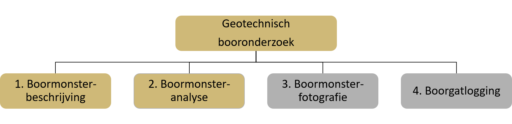

[h2 is vereist vanwege ReSpec]: #
<h2>Geotechnisch booronderzoek</h2>

# Inleiding
  
De catalogus voor het geotechnisch booronderzoek beschrijft de gegevens die in de registratie ondergrond zijn opgenomen van het booronderzoek dat vanuit het vakgebied van de geotechniek is uitgevoerd. De catalogus beschrijft de algemene gegevens van dit booronderzoek samen met de gedetailleerde uitwerking van de gegevens van de boormonsterbeschrijving, en van de gegevens die voortkomen uit het analyseren van boormonsters.

Een booronderzoek is het geheel van gegevens dat betrekking heeft op een specifiek booronderzoek dat op een specifiek moment en op een specifieke locatie in Nederland is uitgevoerd en onder een bepaalde opdracht is uitgevoerd. De belangrijkste gegevens om het onderzoek te preciseren zijn het vakgebied en de uitgevoerde deelonderzoeken.

Booronderzoek in de basisregistratie ondergrond omvat onderzoek uit vier verschillende vakgebieden. Naast geotechniek zijn dat bodemkunde, geologie en cultuurtechniek. De catalogus voor het registratieobject komt in delen tot stand. Eerst wordt voor ieder vakgebied een catalogus gemaakt. Wanneer de vier catalogi gereed zijn wordt een nieuwe catalogus gemaakt die alle vakgebieden omvat en waarin de ongewenste verschillen zijn weggenomen. Die catalogus geeft een samenhangende beschrijving van het registratieobject booronderzoek.

## Geotechnisch booronderzoek

Geotechnisch booronderzoek wordt uitgevoerd in het kader van projecten in de grond-, weg- en waterbouw en in de woning- en utiliteitsbouw. Het onderzoek heeft tot doel de opbouw en de eigenschappen van de ondergrond te onderzoeken om de locatie, het ontwerp, de uitvoering of de toestand van bouwwerken te kunnen vaststellen. Het kan een verkennend karakter hebben en dan is het veelal voldoende de opbouw van de ondergrond globaal te bepalen. Vaker wil men precies weten hoe de ondergrond is opgebouwd en uit welk soort materiaal die bestaat en laat men monsters onderzoeken om bepaalde eigenschappen te bepalen om die in allerlei berekeningen te kunnen gebruiken. Het uiteindelijke doel daarbij is bijvoorbeeld het draagvermogen, het zettingsgedrag of de stabiliteit van de ondergrond in algemenere zin te bepalen of aspecten als de erosiebestendigheid.

De verscheidenheid in geotechnisch booronderzoek is groot. Het wordt zowel op land als op zee uitgevoerd en kan tot wel 150 meter diepte onder maaiveld of waterbodem reiken. In het grootste deel van Nederland bestaat de ondergrond op die diepte uit grond, maar in het zuiden en oosten wordt op bepaalde plaatsen het gesteente bereikt.

Voorts beperkt geotechnisch onderzoek zich niet tot de natuurlijke ondergrond, maar richt het zich ook op grondlichamen die door de mens zijn neergelegd.

Om de informatie die voortkomt uit geotechnisch booronderzoek te kunnen standaardiseren zijn grenzen gesteld aan de verscheidenheid en worden niet alle resultaten of alle vormen van onderzoek in de basisregistratie ondergrond opgenomen. Het accent ligt op standaard geotechnisch booronderzoek. Wat dat inhoudt is in de gegevensdefinitie vastgelegd. Uitgangspunt daarbij is dat de informatie in de basisregistratie ondergrond alleen betrekking heeft op boringen die verticaal bedoeld zijn. Gegevens die niet onder het standaard onderzoek vallen zijn niet opgenomen. Wanneer de grenzen verlegd worden, en dat zal in de toekomst zeker gebeuren, zal de gegevensdefinitie moeten worden aangepast.

Geotechnisch booronderzoek is een van de vier soorten booronderzoek in de basisregistratie ondergrond en het komt voor dat booronderzoek vanuit een combinatie van vakgebieden is uitgevoerd. De bijzondere eisen die voor een dergelijke combinatie gelden, worden in de catalogus die voor het booronderzoek in zijn geheel gaat gelden vastgelegd.

Archeologisch en milieukundig booronderzoek vallen buiten het bereik van de basisregistratie ondergrond. Wanneer geotechnisch onderzoek wordt gecombineerd met archeologisch of milieukundig onderzoek wordt alleen het geotechnische onderzoek in de basisregistratie ondergrond opgenomen. In zo’n geval wordt wel gepreciseerd dat slechts een deel van de resultaten is geregistreerd.

## Boren

Booronderzoek omvat vormen van onderzoek die ermee beginnen dat de ondergrond door boren wordt ontsloten. Wat onder boren moet worden verstaan is in verreweg de meeste gevallen triviaal, het is het maken van een gat met behulp van een apparaat dat we een boor noemen. In de definities wordt duidelijk dat er ook andere manieren zijn om een gat in de ondergrond te maken en die worden gemakshalve toch tot het boren gerekend. Er worden ook gaten in de ondergrond gemaakt met afwijkende methoden die buiten het bereik van deze catalogus vallen. Dat zijn allemaal methoden die op water worden gebruikt en die tot doel hebben een hap uit de waterbodem te nemen. Apparaten die daarvoor gebruikt worden zijn bijvoorbeeld de boxcorer en de Van Veen-bodemhapper. Onderzoek dat gebaseerd is op dergelijke technieken valt buiten het bereik van de basisregistratie ondergrond en de reden daarvoor is dat de resultaten een zeer geringe waarde voor hergebruik hebben, omdat de diepte van het bemonsterde interval niet goed bepaald is en de waterbodem binnen korte tijd kan veranderen.

## Kwaliteit van monsters

De gegevens over de opbouw en de eigenschappen van de ondergrond die uit geotechnisch booronderzoek voortkomen, zijn gebaseerd op monsters die uit de ondergrond genomen zijn. Voor het hergebruik van de gegevens is het van belang te weten in welke mate de monsters waarop de waarnemingen en metingen zijn gebaseerd representatief geacht kunnen worden voor de situatie in-situ. Anders gezegd, voor hergebruik is het van belang de kwaliteit van de monsters vast te leggen.

e kwaliteit van de monsters is van een groot aantal factoren afhankelijk: hoe er geboord is, hoe de monsters genomen zijn, met wat voor apparaat, hoe de monsters boven de grond zijn behandeld, getransporteerd en opgeslagen. De gegevens over het boren, bemonsteren en de relevante specificaties van het apparaat zijn in deze catalogus opgenomen. Die gegevens bepalen het maximaal te bereiken kwaliteitsniveau. Om die kwaliteit in het verdere proces te kunnen behouden, zijn binnen het werkveld procedures opgesteld. Monsters worden ingedeeld in categorieën en voor iedere categorie is vastgelegd hoe de monsters behandeld moeten worden vanaf het moment dat ze boven de grond zijn gekomen. In de catalogus wordt verwezen naar die procedures. In hoeverre de kwaliteit op het moment dat de monsters worden beschreven of geanalyseerd afwijkt van de initiële kwaliteit, wordt vastgelegd als onderdeel van het onderzoek.

De eisen die een gebruiker van de basisregistratie aan de gegevens over de kwaliteit van monsters stelt worden vooral bepaald door het detail dat hij zoekt. Wil de gebruiker een globaal inzicht in de opbouw van de ondergrond verkrijgen, dan zal het voldoende zijn te weten of de monsters geroerd of ongeroerd zijn. Wil een geotechnisch adviseur gegevens uit de boormonsteranalyse gebruiken in berekeningen, dan zal hij de details willen kennen om de waarde van een gegeven te kunnen bepalen.

## Deelonderzoeken

Geotechnisch booronderzoek omvat gewoonlijk drie van de vier deelonderzoeken die in booronderzoek kunnen worden onderscheiden en dat zijn de boormonsterbeschrijving, de boormonsteranalyse en de boormonsterfotografie. Het vierde deelonderzoek, de boorgatlogging, het onderzoek waarin het boorgat wordt bemeten, wordt weinig uitgevoerd. Van de vier deelonderzoeken zijn er twee in deze versie van de catalogus opgenomen, de boormonsterbeschrijving en de boormonsteranalyse [deelonderzoeken](deelonderzoeken).

			<figure id='deelonderzoeken'>
          		
          		<figcaption>Geotechnisch booronderzoek in deze versie van de catalogus; boormonsterfotografie en boorgatlogging zijn nog buiten scope.</figcaption>
			</figure>

In de boormonsterbeschrijving wordt het materiaal dat uit de ondergrond naar boven is gehaald, beschreven op een manier die inzicht geeft in de opbouw van de ondergrond en de globale eigenschappen ervan. In het laboratorium worden allerlei proeven uitgevoerd om de samenstelling en een grote verscheidenheid aan eigenschappen nauwkeurig te bepalen. De verscheidenheid aan bepalingen is groot en iedere bepaling vraagt een eigen definitie. Dat vergt tijd en om die reden wordt de standaardisatie van boormonsteranalyse in twee fasen gerealiseerd.

## Verandering in de beschrijfprocedure van grond

Sinds 2017 is onder verantwoordelijkheid van NEN gewerkt aan een Nederlandse annex op NEN-EN-ISO 14688-1. Dat deel van de norm gaat over de identificatie van grond en vervangt binnen de wereld van de geotechniek NEN 5104. De verandering is groot omdat er op een manier naar grond wordt gekeken die wezenlijk anders is dan wat gebruikelijk was. In NEN-EN-ISO 14688-1 is de identificatie van grond geheel en al gebaseerd op visuele en tactiele waarneming, op zien en voelen. Bij het voelen staan de aspecten centraal die over het gedrag van grond gaan.

De oude NEN 5104 was eerder een classificatiesysteem waarmee het mogelijk was een willekeurig mengsel precies te benoemen wanneer het gehalte aan grind, zand, silt, lutum en organische stof nauwkeurig was bepaald. Die benadering werkt prima wanneer de gehaltes werkelijk gemeten zijn door proeven uit te voeren. Om de benadering toe te passen bij het beschrijven van monsters gebaseerd op alleen zintuigelijke waarneming, moesten referentiemonsters waarvan de samenstelling door metingen was bepaald gebruikt worden. Dat bleef in de praktijk dikwijls achterwege. Bovendien kende de methode bezwaren van meer fundamentele aard, waardoor al lange tijd werd ervaren dat de norm niet meer goed aansloot op de eisen van het geotechnisch werkveld.

## Gevolgen van de verandering

In de basisregistratie ondergrond kunnen niet alleen beschrijvingen die onder NEN-EN-ISO 14688-1 zijn gemaakt, maar ook beschrijvingen die onder NEN 5104 zijn gemaakt worden geregistreerd. De verandering in de methode van beschrijven maakt dat het verschil tussen een boormonsterbeschrijving die onder NEN 5104 tot stand is gekomen en een die onder NEN-EN-ISO 14688 is gemaakt groot is. Onder NEN 5104 worden minder gegevens vastgelegd, is de samenhang minder strikt geborgd en kan de betekenis van gegevens anders zijn. Sommige gegevens kunnen alleen bestaan onder NEN 5104, andere gegevens kunnen juist niet bestaan onder die norm. Een ander verschil is dat de nieuwe methode een strikt onderscheid maakt tussen gegevens die uit het beschrijven en de gegevens die uit het meten voortkomen. In het verleden was dat niet het geval met als gevolg dat niet altijd duidelijk is waarop de gegevens van een oude beschrijving berusten.

Overigens valt een boormonsterbeschrijving die onder NEN 5104 tot stand is gekomen per definitie onder booronderzoek met kwaliteitsregime IMBRO/A.

## Beschrijving van gesteente

Hoewel het meeste geotechnisch booronderzoek zich richt op grond, kan het ook betrekking hebben op gesteente of een combinatie van grond en gesteente. De procedures voor het beschrijven van grond en gesteente verschillen; in de beschrijfwijze van gesteente is de afgelopen jaren geen verandering gekomen. Voor gesteente geldt sinds 2004 NEN-EN-ISO 14689, en in februari 2018 is daarvan een nieuwe versie gepubliceerd. Voor deze norm bestaat geen Nederlandse annex. Wel is de totstandkoming van de Nederlandse annex op NEN-EN-ISO 14688-1 aangegrepen om binnen Nederland af te spreken welke gegevens van gesteente moeten worden vastgelegd. Het resultaat is in deze catalogus opgenomen.

# Belangrijkste entiteiten

## Booronderzoek

## Registratiegeschiedenis

## Rapportagegeschiedenis

## Boring

## Bemonsteringsapparaat

## Terreintoestand

## Sliblaag

## Boormonsterbeschrijving

## Boorprofiel

## Laag

## Grond

## Gesteente

## Post-sedimentaire discontinuïteit

## Boormonsteranalyse

## Onderzocht interval

## Onderzocht materiaal

## Bepaling van de zettingseigenschappen

## Bepaling van de maximale ongedraineerde schuifsterkte

## Bepaling van het schuifspanningsverloop bij belasting

## Bepaling van het schuifspanningsverloop bij horizontale vervorming

## Bepaling van de consistentiegrenzen

## Bepaling van de korrelgrootteverdeling

## Bepaling van de verzadigde waterdoorlatendheid

## Bepaling van het watergehalte

## Bepaling van het organischestofgehalte

## Bepaling van het kalkgehalte

## Bepaling van de volumieke massa

## Bepaling van de volumieke massa vaste delen

# INSPIRE

Het doel van de Europese kaderrichtlijn INSPIRE is het harmoniseren en openbaar maken van ruimtelijke gegevens van overheidsorganisaties ten behoeve van het milieubeleid. Het registratieobject booronderzoek valt wat het geotechnisch onderzoek betreft onder het INSPIRE-thema Geology, en om die reden moeten de gegevens in het registratieobject geschikt gemaakt worden voor uitwisseling volgens de INSPIRE-standaard. Dit wordt geïmplementeerd middels een mapping van het gegevensmodel van het Geotechnisch booronderzoek op het gegevensmodel van het INSPIRE-thema. De inhoud van deze mapping is geen onderdeel van deze catalogus.
